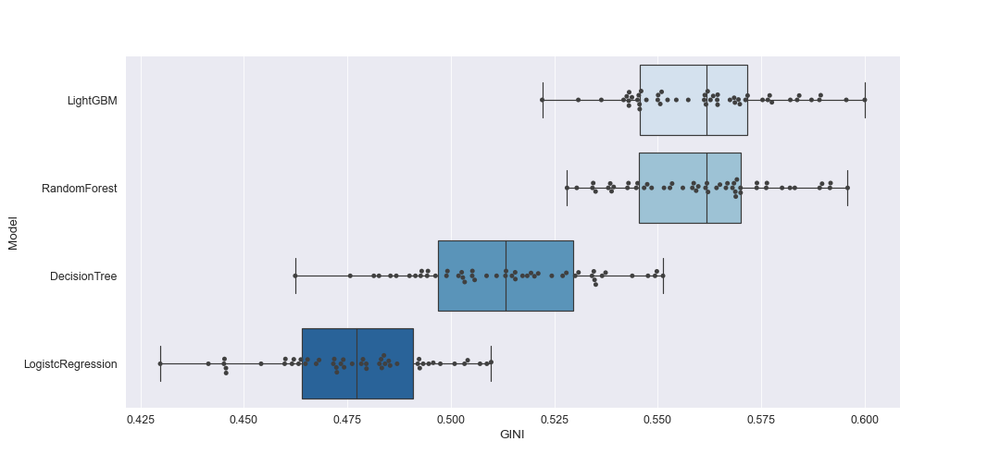
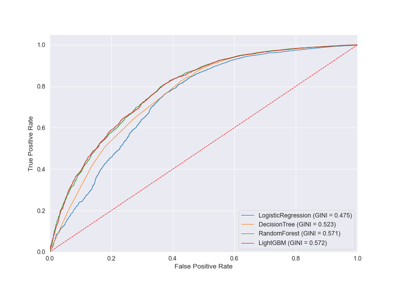
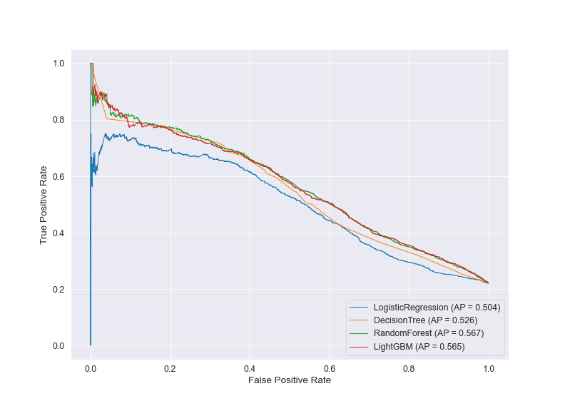
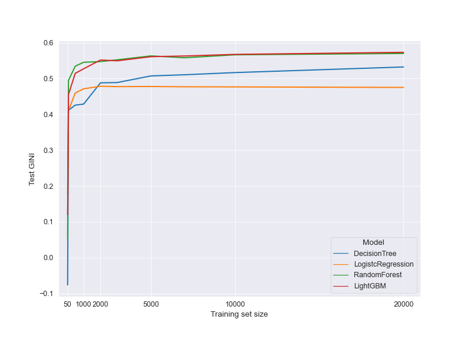
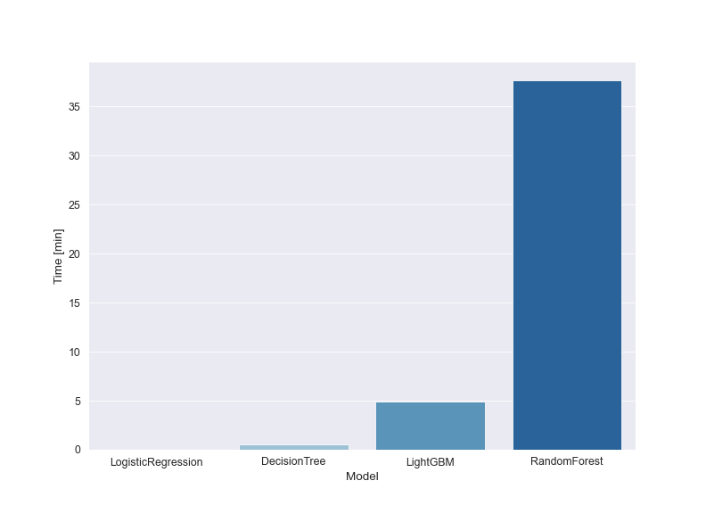

# ml-scoring

Repository with code relevant to the master's thesis "Comparison of classic models of credit risk assessment with models based on an advanced machine learning algorithms" written at Gdansk University of Technology, Faculty of Applied Physics and Mathematics.

## Preparation
- Prerequisites
  - Python 3.x
  - scikit-learn 0.24.1
  - mlxtend 0.18.0
  - lightgbm 3.2.1
  - optuna 2.7.0
- Data:
  - In the experiments we used [*Default of credit card clients data set from UCI Machine Learning repository*](https://archive.ics.uci.edu/ml/datasets/default+of+credit+card+clients).
  - 2/3 of the data was randomly selected as a training set and 1/3 as a test set. When performing hyperparameter optimization, the train set was further splitted using 10 5-fold cross-validation scheme.

## Reproduction

The exact environment can be recreated with ml-scoring.yml file:

```
conda env create -f ml-scoring.yml
```

## Results


The main performance metric used in the thesis GINI coefficient, as it is more popular in the credit risk field. GINI coefficient is directly related to ROC AUC by the following formula 

GINI = 2 * AUC - 1.

Average precision (AP) was used as a complementary performance metric.

Summary of performed experiments:

|              Model | Mean val GINI | Std val GINI | Test GINI | Test AP |
|-------------------:|--------------:|-------------:|----------:|--------:|
| LogisticRegression | 0.476         | 0.009        | 0.475     | 0.504   |
| DecisionTree       | 0.513         | 0.010        | 0.523     | 0.526   |
| RandomForest       | 0.560         | 0.009        | 0.571     | **0.567**   |
| **LightGBM**           | **0.561**         | 0.009        | **0.572**     | 0.565   |

Conclusions of performed experiments:

1. There is a significant difference in performance between logistic regression (mean cross-validated GINI=0.476), decision tree (GINI=0.513), and random forest and LightGBM (GINI=0.560 and GINI=0.561). This observation holds also for the out-of-sample test set. What is more, the average precision (a metric more sensitive for highly imbalanced data) indicates the same conclusion - classical approaches have significantly worse performance (logistic regression AP=0.504, decision tree AP=0.526, random forest AP=0.567, LightGBM AP=0.565).



*Figure 1: GINI obtained during 10 5-fold cross-validation for all tested algorithms*



*Figure 2: ROC curve for all tested algorithms*



*Figure 3: Precision-Recall curve for all tested algorithms*

2. Dataset used in experiments is relatively large (30k instances splitted into 20k training samples and 10k test samples). To investigate the relationship between the training data size and the algoritms performance, we designed an experiment where models were build on training set limited to 50, 100, 500, 1000, 2000, 3000, 5000, 7000, 10000, 2000 instances (at the same time performance was measured in every case on full 10k test set):
   - Logistic regression achieve a plateau around 1000 samples, whereas for random forest and LightGBM this cutoff was around 5000 samples.
   - Even for smaller sample sizes (less than 1000 instances), logistic regression is outperformed by rf/lgbm.
   - Decision tree has worse performance than rf/lgbm, but outperforms logistic regression for training sets with more than 2000 instances.



*Figure 4: Performance of models for increasing training set size*

3. Although random forest obtained similar performance to LightGBM, the time needed to perform hyperparameter tuning was significantly larger. Therefore, LightGBM seems to be a much better choice to use in practice.



*Figure 5: Time [min] needed to perform 150 trials in the optuna hyperparameter optimization study for all tested algorithms*
