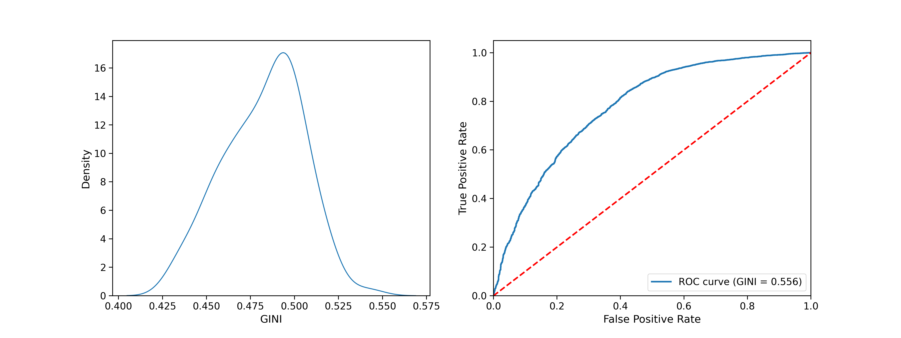

# ml-scoring

## Logistic regression

Below you can fin information values of variables in the dataset.

| Variable  | IV   |
|-----------|------|
| PAY_0     | 0.88 |
| PAY_2     | 0.55 |
| PAY_3     | 0.42 |
| PAY_4     | 0.37 |
| PAY_5     | 0.34 |
| PAY_6     | 0.29 |
| LIMIT_BAL | 0.18 |
| PAY_AMT1  | 0.15 |
| PAY_AMT2  | 0.14 |
| PAY_AMT3  | 0.12 |
| PAY_AMT4  | 0.09 |
| PAY_AMT6  | 0.09 |
| PAY_AMT5  | 0.08 |
| EDUCATION | 0.04 |
| AGE       | 0.02 |
| BILL_AMT6 | 0.02 |
| SEX       | 0.01 |
| MARRIAGE  | 0.01 |
| BILL_AMT1 | 0.01 |
| BILL_AMT2 | 0.01 |
| BILL_AMT3 | 0.01 |
| BILL_AMT4 | 0.01 |
| BILL_AMT5 | 0.01 |

Distribution of GINI across crossvalidation folds and ROC curve for example train/test split.

## Results

|                      | Taiwan 30k | Taiwan 10k | Taiwan 1k |
|----------------------|------------|------------|-----------|
| Logistic regression  | 0.482 (0.011) | 0.476 (0.022) | 0.448 (0.045) |
| Decision tree        |            |            |           |
| Random forest        |            |            |           |
| LightGBM             |            |            |           |