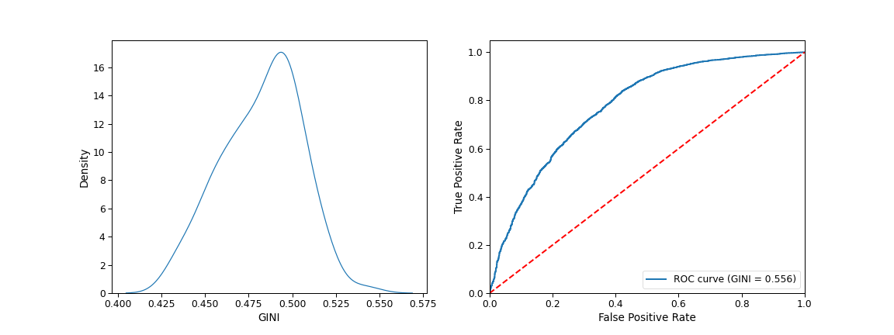
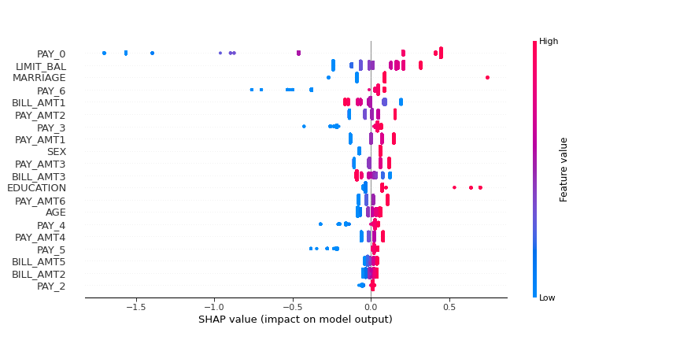

# ml-scoring

## Logistic regression

Distribution of GINI across crossvalidation folds and ROC curve for example train/test split:

Shap values:

## Results

|                      | Taiwan 30k | Taiwan 10k | Taiwan 1k |
|----------------------|------------|------------|-----------|
| Logistic regression  | 0.482 (0.011) | 0.476 (0.022) | 0.448 (0.045) |
| Decision tree        |            |            |           |
| Random forest        |            |            |           |
| LightGBM             |            |            |           |